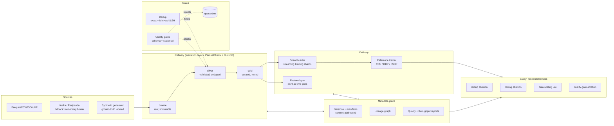

# Architecture

> Status: Phase 3. Bronze ingestion, medallion storage, DuckDB catalog views, the quality
> gate (bronze→silver with quarantine), PSI drift detection, exact + MinHash/LSH dedup, and
> ground-truth scoring of both stages are shipped, all exercised by the offline smoke path.
> Sections for unbuilt subsystems are design intent, not documentation of shipped code; see
> [roadmap.md](roadmap.md) for phase status.

## System overview

## Principles

1. **Medallion layers are contracts.** bronze = raw and immutable; silver = schema-valid,
   quality-gated, deduplicated; gold = curated mixtures ready for sharding. Promotion between
   layers is gated and every promotion emits a lineage event.
2. **The metadata plane is the product.** Datasets are content-addressed (SHA-256 of canonical
   records); a version = (config, input hashes, code version, output hash). Anything can be
   rebuilt from its config; the hash proves you did.
3. **Ground truth enables measurement.** The synthetic generator labels every defect it plants
   (`gt_kind`, `gt_dup_of`). Pipeline stages never read those fields; the harness scores stage
   output against them, so dedup precision/recall and gate hit-rates are exact.
4. **Fallbacks over prerequisites.** Kafka → in-memory broker; S3/MinIO → local filesystem;
   Ray/torchrun multi-GPU → single-process CPU. Same interfaces, same tests.

## Module map (grows per phase)

| Module | Phase | Responsibility |
|---|---|---|
| `crucible.synth` | 0 | Deterministic labeled synthetic corpus |
| `crucible.smoke` | 1 | Offline end-to-end smoke checks through bronze |
| `crucible.config` | 0 | YAML → pydantic config loading |
| `crucible.utils.hashing` | 0 | Canonical serialization, content hashes |
| `crucible.ingest` | 1 | Batch/stream connectors, backpressure, idempotent landing |
| `crucible.storage` | 1 | Medallion layers, Parquet/Arrow IO, DuckDB catalog |
| `crucible.quality` | 2 | Validation rules, promotion gate, quarantine, PSI drift (shipped) |
| `crucible.assay` (scoring) | 2 | Ground-truth scoring of pipeline stages (shipped; full harness in 8) |
| `crucible.dedup` | 3 | Exact + MinHash/LSH near-dup removal (shipped) |
| `crucible.versioning` | 4 | Manifests, snapshots, lineage graph |
| `crucible.features` | 5 | Offline feature store, PIT joins, leakage guards |
| `crucible.shards` | 6 | Tokenization, deterministic sharding, resumable iteration |
| `crucible.train` | 6 | Reference transformer + DDP/FSDP entrypoints |
| `crucible.orchestrate` | 7 | DAG runner (idempotent, retryable tasks) |
| `crucible.serve` | 7 | FastAPI metadata API, Streamlit dashboard |
| `crucible.assay` | 8 | Experiment harness + capstone study |
