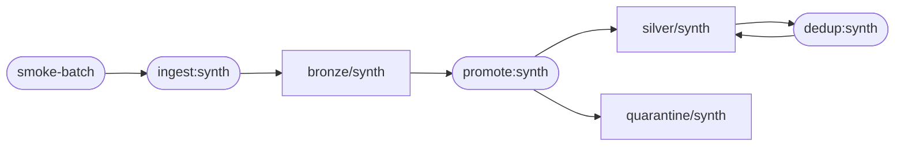

# Versioning & lineage

The metadata plane records *what was built from what, with which config* —
automatically, as a side effect of running the pipeline stages.

## Manifests: dataset identity

`build_manifest(catalog, layer, dataset)` hashes the sorted
`part-name:part-file-sha256` lines into a **content hash** that is stable
across read order, machines, and time (parts are already content-addressed
by name). Two catalogs hold the same dataset iff their manifests' content
hashes match.

## Snapshots: the reproducibility contract, checkable

Every `promote` and `dedup` run writes a snapshot under
`<root>/versions/<dataset>/`:

```
snapshot_id = hash(stage, config_hash, input manifest hashes,
                   code_version, output manifest hash)[:12]
```

- `crucible versions --dataset synth` lists them.
- `crucible verify-snapshot --dataset synth [--snapshot-id ID]` recomputes
  the output manifest and compares — exit 1 if the bytes on disk no longer
  match what the snapshot pinned. A snapshot of pre-dedup silver correctly
  *fails* verification after dedup rewrites silver: stale pins are detected,
  not papered over.
- The smoke test proves the contract end to end: a fresh catalog fed the
  same JSONL, gate config, and dedup config rebuilds silver with a
  **byte-identical content hash** (`byte_identical_rebuild` check).

Ingestion emits lineage but no snapshot: its "config" is an external
source, not a pure function the platform controls.

## Lineage events and the graph

Each stage appends a COMPLETE event to `<root>/lineage/events.jsonl` using
OpenLineage's run-event vocabulary (`eventType`/`run`/`job`/`inputs`/
`outputs` with `contentHash`/`rowCount` facets), so the emitter could point
at a real OpenLineage backend (e.g. Marquez) later. Locally the log folds
into a graph:

```bash
crucible lineage --dataset silver/synth   # upstream ancestry as JSON
crucible lineage --mermaid                # renderable diagram
```

The graph keeps the latest event per job (stages are idempotent; re-runs
supersede). For the smoke pipeline it renders as:



The `silver → dedup → silver` self-edge is real: dedup rewrites silver in
place, and the event's input/output facets carry the pre- and post-rewrite
content hashes, so the two states are distinguishable.

## Scope notes (honest)

- The event log is a local append-only JSONL file, not a lineage server;
  events are OpenLineage-*inspired*, not validated against the spec's JSON
  schema.
- Blocked promotions emit an event with empty outputs and a
  `verdict: blocked` facet — failed runs are part of lineage too.
